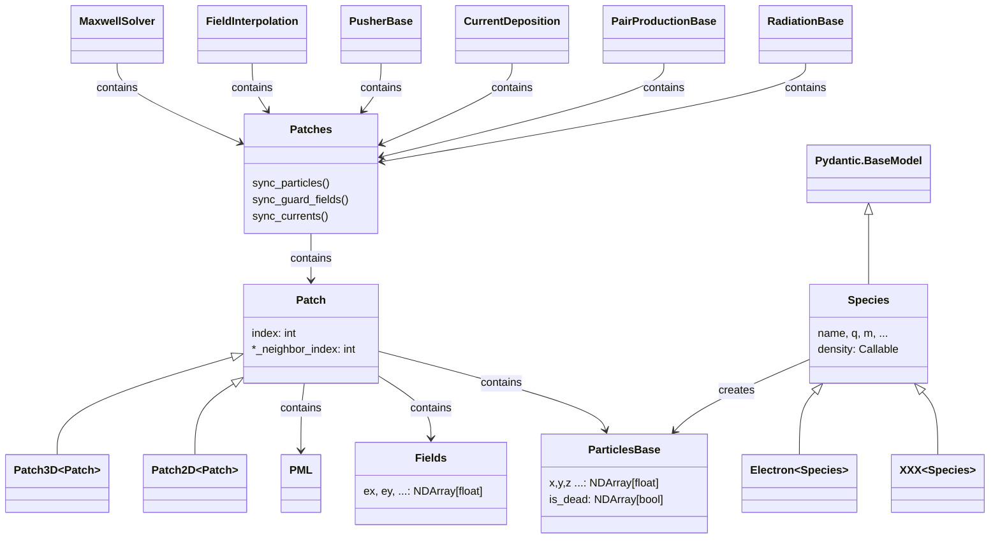

# PIC Simulation Library

## Introduction
`libpic` is a high-performance Particle-In-Cell (PIC) simulation framework implemented in Python. The core functionalities of `libpic` include electromagnetic field solvers, particle pushers, interpolators, and current depositors.

`libpic` serves as the backend for `λPIC` (will be released soon). Performance optimizations are achieved through the use of Numba JIT and Cython.

**This project is under construction.**

## Project Roadmap

- [ ] Functionalities
  - [x] Maxwell solver
  - [x] Particle pusher
  - [x] Interpolator
  - [x] Current depositor
  - [ ] QED
    - [x] Photon emission
    - [x] Pair production
  - [x] CPML boundary
  - [ ] Collision
  - [ ] Nuclear physics
- [ ] Replace Numba JIT and Cython with C extensions
  - [x] Current depositor
  - [x] Patch synchronizer
  - [ ] Maxwell solver
  - [ ] Particle pusher
    - [x] unified pusher
  - [x] Interpolator
  - [x] sorter
  - [ ] PML
- [ ] Remove dependence on numba.typed.List
- [ ] MPI
- [ ] 3D
  - [ ] QED
- [ ] GPU acceleration
- [ ] Documentation

## Installation

From PyPI:

```bash
pip install libpic
```

From source:

```bash
git clone https://github.com/xsgeng/libpic.git
pip install -e ./libpic
```
## Core Classes

## Acknowledgments

This work was supported by the National Natural Science Foundation of China (NSFC) under Grant No. 12304384.

This project was inspired by and adapted elements from the [EPOCH](https://github.com/Warwick-Plasma/epoch) and the [Smilei](https://github.com/SmileiPIC/Smilei) projects.
